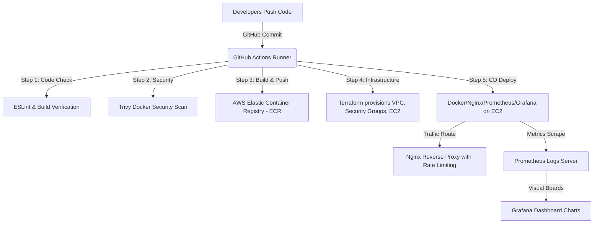

# 🤝 Professional DevOps Master Guide & Roadmap

## VendorBridge (ProcurementPal) Deployment & DevOps Lifecycle

Welcome! This guide is designed to take you from a complete beginner to a confident **DevOps Engineer** by deploying this project (**VendorBridge**) using a production-grade enterprise DevOps toolchain.

We will use **Docker**, **Kubernetes**, **Terraform (IaC)**, **GitHub Actions**, **Nginx**, and **Prometheus/Grafana** running on an **AWS Free Tier** account.

---

## 🗺️ The Modern DevOps Toolchain Architecture

This diagram shows how all the files and tools we created connect to form a professional DevOps deployment cycle:



---

## 🛠️ Step-by-Step Practical Implementation Guide

### 📦 Phase 1: Local Containerization (Docker & Compose)

We use **Docker** to box the application so it runs the exact same way on your laptop and in production.

#### 1. Test your Dockerfile locally

Build the container image using the `Dockerfile` we created:

```bash
docker build -t procurement-pal:local .
```

#### 2. Run the application using Docker Compose

Open your local terminal and run:

```bash
docker compose up --build
```

This single command spins up:

- The React/TanStack Start web app at `http://localhost:3000`
- Nginx reverse proxy at `http://localhost:80`
- Prometheus UI at `http://localhost:9090`
- Grafana dashboard at `http://localhost:3001` (login with `admin` / `admin`)

---

### 🌐 Phase 2: Infrastructure as Code (Terraform & AWS)

Instead of clicking around the AWS console web interface to set up virtual machines, network subnets, and firewalls, we write **Terraform** files (`/terraform`) to automate the process.

#### 1. Setup your AWS Credentials locally

1. Go to the AWS Console -> **IAM** (Identity and Access Management).
2. Create a user (e.g., `devops-admin`) with `AdministratorAccess`.
3. Go to Security Credentials, create an **Access Key ID** and **Secret Access Key**.
4. Install the AWS CLI on your system and run:
   ```bash
   aws configure
   ```
   Provide your Access Key, Secret Key, default region (e.g., `us-east-1`), and output format (`json`).

#### 2. Initialize and Apply Terraform

Open your terminal, navigate to the `/terraform` folder, and run:

```bash
cd terraform
terraform init
```

This downloads the AWS providers. Now, run:

```bash
terraform plan
```

This shows you exactly what resources AWS will create. To provision them, run:

```bash
terraform apply
```

Type `yes` when prompted. Terraform will output your EC2 server's **Public IP Address** and your **AWS ECR Repository URL**.

---

### 🔄 Phase 3: Continuous Integration & Deployment (GitHub Actions)

We set up a CI/CD pipeline using **GitHub Actions** to automatically build, scan, test, and deploy our code on every git push.

#### 1. Create GitHub Secrets

Navigate to your GitHub repository -> **Settings** -> **Secrets and variables** -> **Actions** -> **New repository secret** and add:

- `AWS_ACCESS_KEY_ID`: Your IAM user access key.
- `AWS_SECRET_ACCESS_KEY`: Your IAM user secret key.
- `AWS_REGISTRY_URL`: Your AWS ECR Registry URL (obtained from Terraform outputs, e.g., `<ACCOUNT_ID>.dkr.ecr.us-east-1.amazonaws.com`).
- `VITE_SUPABASE_URL`: Your Supabase database endpoint URL.
- `VITE_SUPABASE_PUBLISHABLE_KEY`: Your Supabase anon API key.
- `EC2_HOST_IP`: The Public IP of your EC2 instance (obtained from Terraform outputs).
- `EC2_SSH_PRIVATE_KEY`: The contents of the SSH private key (`.pem` file) you created in AWS EC2 Console to access the server.

#### 2. How the Pipeline Works

Every time you push to the `main` branch:

1. **Lint & Check:** ESLint runs static code analysis to catch syntax bugs.
2. **Security Scan (Trivy):** Scans the built Docker image for software package vulnerabilities.
3. **AWS Push:** Logs into ECR and uploads the new Docker image.
4. **Deploy:** SSHs into your EC2 server, downloads the new image, kills the old container, and spins up the new container with zero manual intervention.

---

### 🚦 Phase 4: Production Routing & SSL (Nginx & HTTPS)

In production, users shouldn't have to write port `:3000` or `:3001` in the browser. They should access `http://yourdomain.com` or `https://yourdomain.com`.

- **Reverse Proxying:** Nginx receives the traffic on port 80 (HTTP) or 443 (HTTPS) and securely passes it inside to the Docker container on port 3000.
- **SSL Certificates:** Install `certbot` on your EC2 instance:
  ```bash
  sudo apt install certbot python3-certbot-nginx -y
  sudo certbot --nginx -d yourdomain.com
  ```
  This automatically issues free SSL certificates from **Let's Encrypt** and configures Nginx for HTTPS redirect.

---

### 📊 Phase 5: Monitoring & Metrics (Prometheus & Grafana)

A DevOps engineer needs to know _when_ a server goes down or runs out of RAM.

- **Prometheus** continuously pulls data from your application metrics route.
- **Grafana** displays this data in real-time charts.
- **Setup Tip:** In the Grafana UI (`http://localhost:3001`), add Prometheus as a Data Source (URL: `http://prometheus:9090`). Create a new dashboard to visualize memory and CPU workloads.

---

### ☸️ Phase 6: Orchestration & Scaling (Kubernetes)

If your app goes viral, one EC2 instance will fail. **Kubernetes (K8s)** manages clusters of servers and containers.

#### How to practice Kubernetes locally:

1. Install **Minikube** (a local single-node K8s cluster) or **k3d**.
2. Start Minikube:
   ```bash
   minikube start
   ```
3. Deploy the application:
   ```bash
   kubectl apply -f k8s/deployment.yaml
   kubectl apply -f k8s/service.yaml
   kubectl apply -f k8s/ingress.yaml
   ```
4. Verify they are running:
   ```bash
   kubectl get pods
   kubectl get services
   ```
5. Kubernetes will automatically balance traffic between multiple containers (replicas) and auto-restart any crashed pods!

---

## 🚀 DevOps Career Roadmap & Study Plan

To become a professional DevOps engineer, study these topics in this order:

1. **Linux Command Line & Shell Scripting (Bash):** Managing files, permissions, SSH, logs, and processes on servers.
2. **Networking Basics:** IP Addresses, Subnets, DNS, HTTP/HTTPS, SSL/TLS, firewalls, and ports.
3. **Git Version Control:** Commits, branches, PRs, merge conflict resolution.
4. **Docker:** Writing clean multi-stage Dockerfiles, caching layers, container networking, and Docker Compose.
5. **CI/CD Pipelines:** Automation concepts, YAML configuration, security scanners (Trivy/Hadolint), build workflows.
6. **Infrastructure as Code (Terraform):** State management, variables, modules, provider integration, and drift detection.
7. **Cloud Providers (AWS / GCP / Azure):** Core compute (EC2), networking (VPC), access management (IAM), storage (S3), and managed services.
8. **Container Orchestration (Kubernetes):** Pods, Deployments, Services, ConfigMaps, Secrets, Ingress Controllers, Helm charts.
9. **Monitoring & Observability:** Prometheus metrics, Grafana visualization, ELK stack (Elasticsearch, Logstash, Kibana) or Loki for logging.
