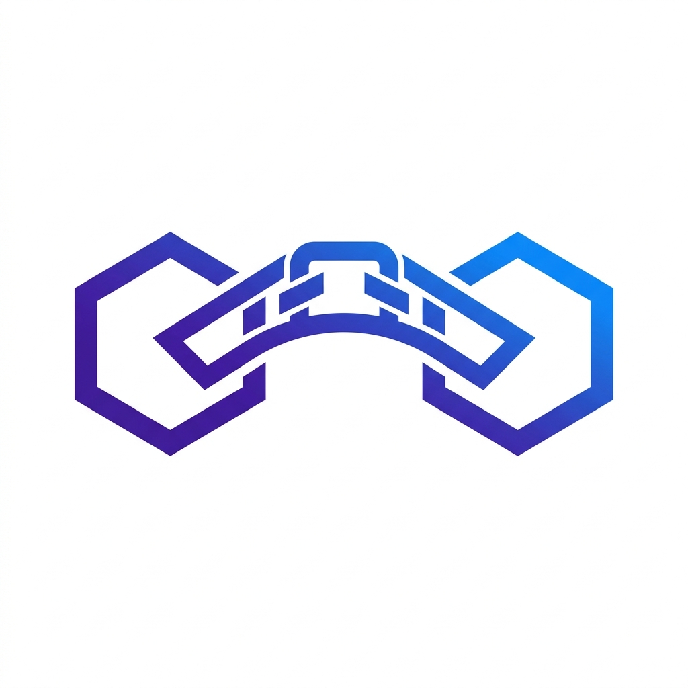
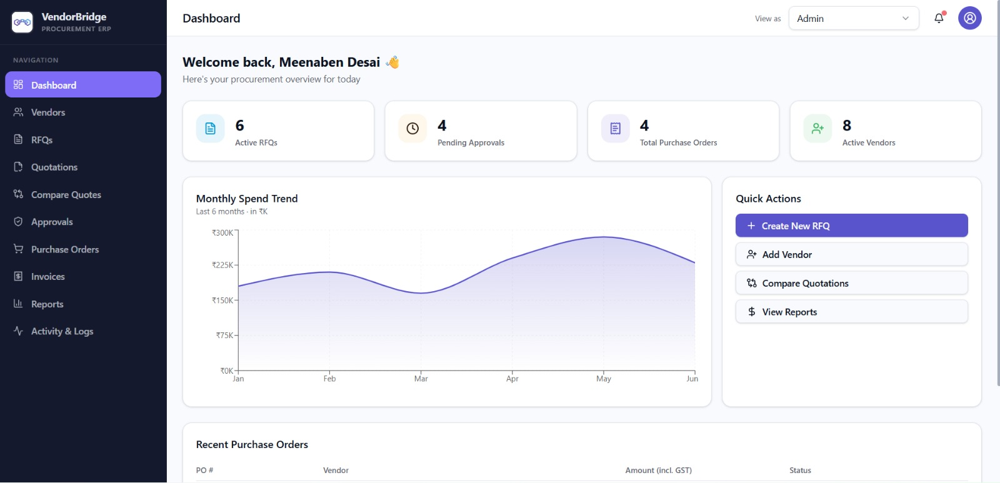
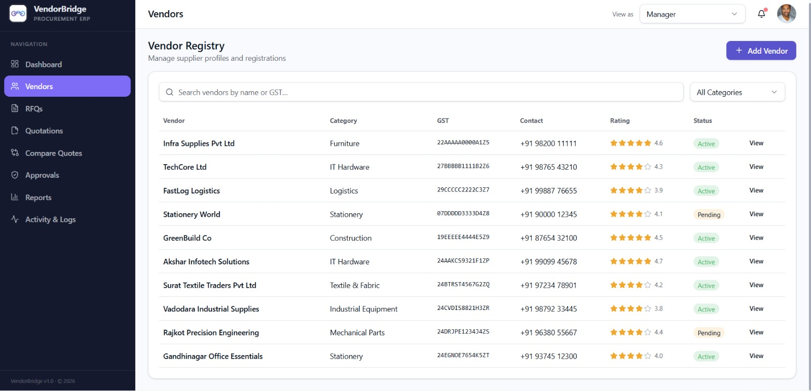
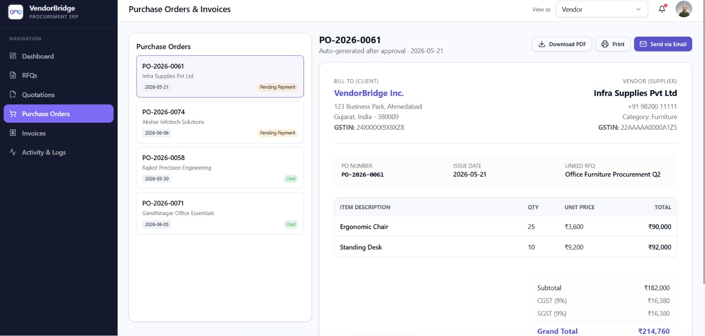

<p align="center">
  
</p>

<h1 align="center">🤝 VendorBridge (ProcurementPal)</h1>
<p align="center">
  <strong>Next-Gen Procurement ERP & Vendor Connect Platform</strong><br>
  Built for the <strong>Odoo Gandhinagar Hackathon 2026</strong>
</p>

<p align="center">
  <a href="#-project-video-walkthrough">🎥 Video Walkthrough</a> •
  <a href="#-key-features">✨ Key Features</a> •
  <a href="#-interface-showcase">📸 Interface Showcase</a> •
  <a href="#-tech-stack">🛠️ Tech Stack</a> •
  <a href="#-the-odoo-hackathon-team-our-attraction">👥 The Team</a> •
  <a href="#%EF%B8%F0-getting-started">🚀 Getting Started</a>
</p>

---

## 📖 Overview

**VendorBridge** (also known as **ProcurementPal**) is a state-of-the-art, secure, and real-time Procurement ERP system designed to optimize the Request for Quotations (RFQ) lifecycle. From drafting RFQs and collecting vendor bids to comparison matrices, multi-stage approvals, and Purchase Order (PO) settlement, VendorBridge digitalizes and automates the procurement workflow for enterprise operations. 

It is tailored for modern organizations, supporting fine-grained role-based dashboards, regional vendor sourcing, local Gujarat-based seed tracking, and live audit trails.

---

## 🎥 Project Video Walkthrough

Watch the complete demonstration of the VendorBridge platform, covering roles, RFQ-to-PO workflows, real-time database sync, and quotation comparison.

[](https://youtu.be/wQSeuEWr0sY?si=Rb7HvkJgTea1sGpf)

*Click the image above to view the video walkthrough on YouTube.*

---

## ✨ Key Features

- **🔐 Multi-Role Workspaces**: Custom views, actions, and security scopes for:
  - **Procurement Officers**: Draft RFQs, assign vendors, record invoice payments, and register vendors.
  - **Managers**: Compare bids and approve/reject quotations with custom audit comments.
  - **Admins**: Manage application configurations, users, security permissions, and regional branches.
  - **Vendors**: Submit line-item quotations, delivery times, and notes for active RFQs.
- **⚖️ Smart Quotation Comparison Matrix**: Side-by-side comparisons of all submitted bids for a specific RFQ. Highlight mechanisms dynamically identify the lowest cost and quickest delivery timeline.
- **📈 Procurement Analytics**: Interactive dashboard with KPI summaries and monthly spend trends built using `Recharts`.
- **🛡️ Secure Database & RLS**: Integrated with a Postgres Supabase database with customized Row Level Security (RLS) policies to protect pricing and profile data.
- **⚡ OTP & Custom Profile Auth**: Role-based signup, OTP authentication, and custom profile photo updates.
- **📝 Real-time Activity Logs**: An immutable audit trail documenting all system changes (Quotations submitted, RFQs published, POs paid, and Approvals granted).

---

## 📸 Interface Showcase

| 🌟 Dashboard Overview | 📊 Analytics & Reports | ⚖️ Quotation Comparison |
| :---: | :---: | :---: |
|  |  |  |

---

## 🛠️ Tech Stack

- **Frontend Core**: React 19, TypeScript, Vite
- **Routing & Framework**: TanStack Router (Start)
- **Styling**: TailwindCSS 4, Radix UI Primitives, Lucide Icons, Shadcn-inspired custom components
- **Database / Backend**: Supabase (Postgres)
- **State Management & Data Fetching**: TanStack React Query

---

## 👥 The Odoo Hackathon Team (Our Attraction)

Meet the creators behind **VendorBridge**, built during the Odoo Gandhinagar Hackathon:

<table align="center">
  <tr>
    <td align="center" width="33%">
      <br>
      <strong>Kartik Parmar</strong><br>
      <font color="#888">Backend Developer</font><br>
      <sub>Database Architect, Supabase Integration & API Functions</sub>
    </td>
    <td align="center" width="33%">
      <br>
      <strong>Vishva Jagad</strong><br>
      <font color="#888">Frontend Developer</font><br>
      <sub>Application Routing, State Synchronization & Interactive Dashboards</sub>
    </td>
    <td align="center" width="33%">
      <br>
      <strong>Maitry Baraiya</strong><br>
      <font color="#888">UI/UX Designer</font><br>
      <sub>Visual Hierarchy, Responsive Layouts & Sleek Modern Styling</sub>
    </td>
  </tr>
</table>

---

## 🚀 Getting Started

### Prerequisites
Make sure you have [Bun](https://bun.sh/) (recommended) or [Node.js](https://nodejs.org/) installed.

### 1. Clone & Install Dependencies
```bash
git clone https://github.com/kartik-parmar007/Odoo-Gandhinagar-Hackathon.git
cd Odoo-Gandhinagar-Hackathon
bun install  # or npm install
```

### 2. Environment Variables Setup
Create a `.env` file in the root directory and add your Supabase credentials:
```env
VITE_SUPABASE_URL=YOUR_SUPABASE_URL
VITE_SUPABASE_PUBLISHABLE_KEY=YOUR_SUPABASE_ANON_KEY
```

### 3. Database Setup
1. Open your Supabase Dashboard and go to the **SQL Editor**.
2. Copy the contents of [`seed-gujarat-data.sql`](file:///f:/Odoo%20latest%20Hackathon/procurement-pal-connect-main/procurement-pal-connect-main/seed-gujarat-data.sql) and run the script to initialize tables, RLS policies, and core mock profiles/vendors.
3. If you run into row-level authorization issues, run the commands in [`supabase-fix-rls.sql`](file:///f:/Odoo%20latest%20Hackathon/procurement-pal-connect-main/procurement-pal-connect-main/supabase-fix-rls.sql) to permit anonymous actions for hackathon evaluation mode.

### 4. Run Locally
```bash
bun dev  # or npm run dev
```
Open `http://localhost:3000` (or the port specified by Vite) in your browser.
